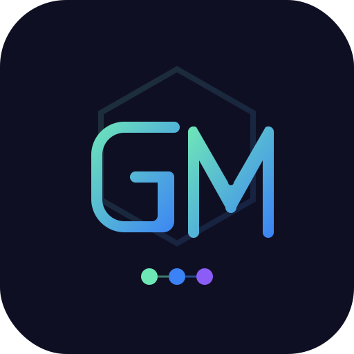

<p align="center">
  
</p>

# gm-skills

A curated collection of agent skills for development workflow, writing, and agent collaboration.

## Install

```bash
npx skills add ZeroZ-lab/gm-skills
```

Install specific skills:

```bash
npx skills add ZeroZ-lab/gm-skills --skill cc-design
npx skills add ZeroZ-lab/gm-skills --skill gm-de-ai-article
npx skills add ZeroZ-lab/gm-skills --skill gm-topic-engine
npx skills add ZeroZ-lab/gm-skills --skill gm-x-hook-writer
npx skills add ZeroZ-lab/gm-skills --skill gm-agent-docs
npx skills add ZeroZ-lab/gm-skills --skill pngimg-download
npx skills add ZeroZ-lab/gm-skills --skill auto-skill-fit
npx skills add ZeroZ-lab/gm-skills --skill ui-fork
```

Install to specific agents:

```bash
npx skills add ZeroZ-lab/gm-skills -a claude-code
npx skills add ZeroZ-lab/gm-skills -a kiro-cli -a cursor
```

List available skills without installing:

```bash
npx skills add ZeroZ-lab/gm-skills --list
```

## Skills

| Skill | Description |
|-------|-------------|
| `cc-design` | High-fidelity HTML design and prototype creation — slide decks, prototypes, landing pages, UI mockups |
| `gm-topic-engine` | 从零散素材中提炼公众号/博客选题，排序优先级 |
| `gm-de-ai-article` | 去除文章中的 AI 味，保住作者判断与表达控制权 |
| `gm-x-hook-writer` | 为 X/Twitter 推文生成高停留率的开头 hook |
| `gm-agent-docs` | 分析项目结构，生成 CLAUDE.md 和 AGENTS.md |
| `pngimg-download` | Search and download free transparent PNG images from pngimg.com |
| `auto-skill-fit` | 扫描项目技术栈，推荐并安装匹配的 agent skills 套装 |
| `ui-fork` | 从 UI 截图提炼设计指南、design tokens 和后续 AI 延续设计约束 |

### auto-skill-fit

扫描项目配置文件，识别技术栈，实时搜索 skills.sh，推荐最匹配的 skills 套装。在 Claude Code 中使用原生多选框：


```bash
npx skills add ZeroZ-lab/gm-skills --skill auto-skill-fit
```

## Structure

```
gm-skills/
├── skills/
│   ├── auto-skill-fit/
│   ├── cc-design/          # submodule → ZeroZ-lab/cc-design
│   ├── gm-agent-docs/
│   ├── gm-de-ai-article/
│   ├── gm-topic-engine/
│   ├── gm-x-hook-writer/
│   ├── pngimg-download/
│   └── ui-fork/
└── README.md
```

## Recommended Skills

其他值得安装的高质量 skills：

```bash
npx skills add garrytan/gstack              # Garry Tan 的全栈开发 skill（QA 测试、代码审查、设计检查）
npx skills add remotion-dev/skills           # 用 React 编程式生成视频
```
