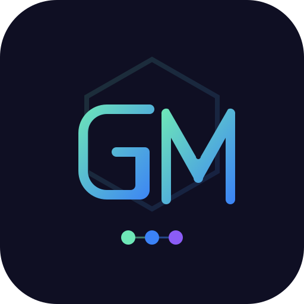

<p align="center">
  
</p>

# gm-skills

`gm-skills` is now a multi-plugin marketplace monorepo. Each plugin is independently installable from the same marketplace and owns its own skill source, manifests, and support files.

## Install

### Claude Code

```bash
/plugin marketplace add ZeroZ-lab/gm-skills
/plugin install gm-topic-engine@gm-skills
/plugin install visual-explanation-layout-engine@gm-skills
```

You can install any listed plugin the same way:

- `auto-skill-fit`
- `gm-agent-docs`
- `gm-de-ai-article`
- `gm-skill-manager`
- `gm-skill-quality`
- `gm-topic-engine`
- `gm-writing-topic-picker`
- `gm-x-hook-writer`
- `mattpocock-skills` (upstream-maintained, see [External / upstream plugins](#external--upstream-plugins))
- `cc-design` (upstream-maintained, see [External / upstream plugins](#external--upstream-plugins))
- `pngimg-download`
- `ui-fork`
- `vs-story`
- `visual-explanation-layout-engine`

### Codex

Codex is supported through the root marketplace at [.agents/plugins/marketplace.json](/Users/zhengjianqiao/workspace/gm-skills/.agents/plugins/marketplace.json).

Install flow in Codex:

1. Open the Codex plugin directory.
2. Add `https://github.com/ZeroZ-lab/gm-skills` as a marketplace.
3. Install the plugin you want from the `gm-skills` marketplace, for example:
   - `gm-topic-engine`
   - `visual-explanation-layout-engine`
   - `cc-design`

If you already added this marketplace before the multi-plugin split, refresh the marketplace in Codex so it pulls the latest catalog instead of the older cached `gm-skills` entry.

## Plugins

| Plugin | Description |
| --- | --- |
| `auto-skill-fit` | 扫描项目技术栈，推荐并安装匹配的 agent skills 套装。 |
| `gm-agent-docs` | 为项目生成 CLAUDE.md 和 AGENTS.md，输出命令优先、按任务分区的 agent 配置文件。 |
| `gm-de-ai-article` | 去除公众号、博客和 newsletter 草稿里的模板化 AI 写作痕迹，保住作者判断与表达控制权。 |
| `gm-skill-manager` | 统一盘点和协调 Codex Plugin、Claude Code Plugin 与 npx skills；ZCode 仅报告为 unmanaged。 |
| `gm-skill-quality` | 审查 agent skills 质量，对 SKILL.md 给出结构化审查报告和优化建议。 |
| `gm-topic-engine` | 从零散想法、笔记和经历中提炼适合公众号与博客的可发布选题池。 |
| `gm-writing-topic-picker` | 判断单个写作题目是否值得写，并给出更锋利的切入角度。 |
| `gm-x-hook-writer` | 为 X/Twitter 推文和 thread 生成更强的开头 hook 和首句。 |
| `pngimg-download` | Search and download free transparent PNG images from pngimg.com. |
| `ui-fork` | 从 UI 截图提炼设计系统草案、组件规则、design tokens 和 AI 延续设计约束。 |
| `vs-story` | 用 Three.js + Anime.js 把概念、流程、系统做成对象驱动的滚动叙事网页，视觉而非文字承担解释。 |
| `visual-explanation-layout-engine` | Turn complex systems, flows, and state changes into mobile-readable HTML + SVG visual explanations. |
| `mattpocock-skills` *(upstream)* | Matt Pocock 的工程类 agent skills 合集（TDD、code review、triage、debugging 等，共 20 个）。代码由上游 [`mattpocock/skills`](https://github.com/mattpocock/skills) 维护，本仓库只登记目录条目。 |
| `cc-design` *(upstream)* | High-fidelity HTML design skill。代码由上游 [`ZeroZ-lab/cc-design`](https://github.com/ZeroZ-lab/cc-design) 维护，本仓库只登记目录条目。 |

## External / upstream plugins

Some plugins are **not** developed in this repo. We only register a marketplace entry pointing at their upstream GitHub repo, so the upstream author keeps maintaining the code while users install through this marketplace.

| Plugin | Upstream repo | Claude | Codex |
| --- | --- | :-: | :-: |
| `mattpocock-skills` | [`mattpocock/skills`](https://github.com/mattpocock/skills) | ✅ | — (上游无 codex manifest) |
| `cc-design` | [`ZeroZ-lab/cc-design`](https://github.com/ZeroZ-lab/cc-design) | ✅ | — (本仓库主动下架，走上游 Claude) |

Install via Claude Code:

```bash
/plugin marketplace add ZeroZ-lab/gm-skills
/plugin install mattpocock-skills@gm-skills
/plugin install cc-design@gm-skills
```

Each entry is declared in [`.claude-plugin/external-plugins.json`](.claude-plugin/external-plugins.json) with a `markets` field (`["claude"]` and/or `["codex"]`) controlling which marketplace lists it. By default entries track the upstream default branch (new skills and fixes flow in automatically on reinstall/refresh). To pin a version, add a `ref` or `sha` to the entry.

> **Updating an upstream plugin:** Claude Code does not auto-refresh in the background. After the upstream ships a change, users need to `/plugin marketplace refresh gm-skills` and `/plugin update <name>@gm-skills` (or reinstall) to pull the latest.

## Structure

```text
gm-skills/
├── .agents/
│   └── plugins/
│       └── marketplace.json
├── .claude-plugin/
│   ├── external-plugins.json
│   ├── marketplace.json
│   └── release.json
├── plugins/
│   ├── auto-skill-fit/
│   │   ├── .claude-plugin/plugin.json
│   │   ├── .codex-plugin/plugin.json
│   │   └── skills/auto-skill-fit/
│   ├── cc-design/
│   │   ├── .claude-plugin/plugin.json
│   │   ├── .codex-plugin/plugin.json
│   │   └── skills/cc-design/
│   └── ...
├── scripts/
│   ├── sync-plugin-package.mjs
│   └── validate-plugin-package.mjs
└── README.md
```

## Development

Each plugin is its own source of truth:

- Edit skill content in `plugins/<plugin-name>/skills/<plugin-name>/`
- Keep support files inside the same plugin package
- Do not add cross-plugin relative dependencies

Sync marketplace metadata and manifest versions:

```bash
npm run plugin:sync
```

Validate the whole monorepo:

```bash
npm run plugin:validate
```

## Release Model

- Root `.claude-plugin/marketplace.json` is the Claude marketplace catalog.
- Root `.agents/plugins/marketplace.json` is the Codex marketplace catalog.
- Each `plugins/<plugin-name>/` directory is a self-contained published plugin.
- The repository uses a single version from [package.json](/Users/zhengjianqiao/workspace/gm-skills/package.json); `npm run plugin:sync` propagates it to every plugin manifest.
